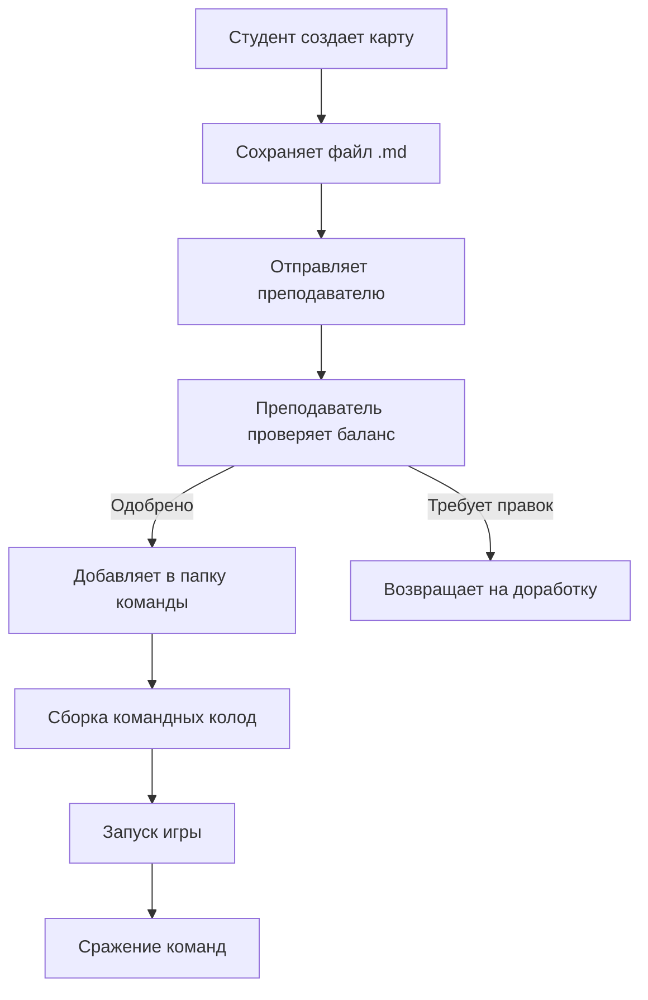

# 🎮 BattleScript - Карточная игра для студентов

<div align="center">


**Создавайте, балансируйте и сражайтесь в эпических карточных битвах!**

[Демо Creator](creator.html) • [Демо Core](core.html)

</div>

## 📋 Содержание

- [✨ Особенности](#-особенности)
- [🎴 Типы карт и их баланс](#-типы-карт-и-их-баланс)
- [⚖️ Правила баланса карт](#️-правила-баланса-карт)
- [🚀 Начало работы](#-начало-работы)
- [🛠️ Создание карт (Creator)](#️-создание-карт-creator)
- [⚔️ Игровой процесс (Core)](#️-игровой-процесс-core)
- [🎨 Оформление карт](#-оформление-карт)
- [📊 Особые способности](#-особые-способности)
- [🏆 Правила игры](#-правила-игры)
- [🔄 Взаимодействие студенты-преподаватель](#-взаимодействие-студенты-преподаватель)
- [📁 Структура проекта](#-структура-проекта)
- [🐛 Устранение неполадок](#-устранение-неполадок)
- [👥 Разработчики](#-разработчики)

## ✨ Особенности

- **🎴 Создание карт** - Визуальный редактор с поддержкой Markdown
- **⚖️ Автобаланс** - Интеллектуальная система расчета стоимости
- **🖼️ Кастомизация** - Аватары и декоративные элементы
- **⚔️ Тактические сражения** - Глубокий игровой процесс с особыми способностями
- **👥 Командная игра** - Две команды студентов создают свои колоды
- **🎨 Современный UI** - Анимации, эффекты, адаптивный дизайн
- **📁 Простая интеграция** - Загрузка через GitHub или локальные файлы

## 🎴 Типы карт и их баланс

### 1. **Существа** (Основной тип)
**Характеристики:**
- Атака (0-10) - Урон, наносимый за ход
- Здоровье (1-10) - Количество урона, которое может выдержать
- **Особенности:** Могут атаковать, могут быть атакованы

### 2. **Заклинания** (Одноразовые эффекты)
**Характеристики:**
- Атака (0-10) - Мгновенный урон цели
- Здоровье (1) - Фиксированное значение (не влияет на баланс)
- **Особенности:** 
  - Исчезают после использования
  - Могут наносить урон сразу при розыгрыше
  - Могут иметь дополнительные эффекты
- **Баланс:** Стоимость рассчитывается как (Атака × 1.5) + способности

### 3. **Артефакты** (Постоянные улучшения)
**Характеристики:**
- Атака (0-5) - Бонус к атаке существ
- Здоровье (1-5) - Бонус к здоровью/защите
- **Особенности:**
  - Остаются на поле постоянно
  - Дают пассивные бонусы союзникам
  - Не могут атаковать напрямую
- **Баланс:** Стоимость = (Атака + Здоровье) + способности × 2

### 4. **Герои** (Особые существа)
**Характеристики:**
- Атака (3-7) - Высокий базовый урон
- Здоровье (5-10) - Высокая выносливость
- **Особенности:**
  - Могут использовать способности каждый ход
  - Дают бонусы команде
  - Дорогие в розыгрыше
- **Баланс:** Стоимость = (Атака + Здоровье) × 0.8 + способности × 3

## ⚖️ Правила баланса карт

### 📐 Формула стоимости
```
Общая стоимость = Базовая стоимость + Стоимость способностей
```

#### Для каждого типа карт:

| Тип | Базовая формула | Макс. сумма А+З | Множитель способностей |
|-----|-----------------|-----------------|------------------------|
| **Существо** | (Атака + Здоровье) ÷ 2 | 15 | ×1 |
| **Заклинание** | Атака × 1.5 | 10 | ×1.5 |
| **Артефакт** | Атака + Здоровье | 8 | ×2 |
| **Герой** | (Атака + Здоровье) × 0.8 | 15 | ×3 |

### ⚠️ Ограничения баланса

1. **Максимальные значения:**
   - Существо: Атака + Здоровье ≤ 15
   - Заклинание: Атака ≤ 10
   - Артефакт: Атака + Здоровье ≤ 8
   - Герой: Атака + Здоровье ≤ 15

2. **Распределение характеристик:**
   - **Высокая атака** → Низкое здоровье
   - **Высокое здоровье** → Низкая атака
   - **Сбалансированная** → Средние значения

3. **Ограничения по способностям:**
   - Максимум 2 способности на карту
   - Не более 1 карты с каждой способностью в команде
   - Дорогие способности увеличивают стоимость

## 🚀 Начало работы

### Требования
- Современный браузер (Chrome 90+, Firefox 88+, Edge 90+)
- Доступ к интернету (для CDN библиотек)
- Локальный сервер или прямое открытие файлов

### Быстрый старт

1. **Скачайте проект:**
```bash
git clone [repository-url]
cd battlescript
```

2. **Запустите в браузере:**
   - Откройте `creator.html` для создания карт
   - Откройте `core.html` для игры

3. **Или используйте Live Server:**
```bash
# Установите Live Server для VS Code
# Или используйте Python:
python -m http.server 8000
# Затем откройте http://localhost:8000
```

## 🛠️ Создание карт (Creator)

### 📝 Шаги создания

1. **Откройте `creator.html`** в браузере
2. **Заполните параметры карты:**
   - Название и тип карты
   - Атака и здоровье (ползунки)
   - Особые способности (до 2-х)
   - URL аватара (опционально)
   - Описание в Markdown
   - Стиль оформления
   - Ваше имя

3. **Используйте правила баланса:**
   - Следите за индикатором стоимости
   - Не превышайте максимальные значения
   - Используйте декоративные элементы

4. **Сохраните карту:**
   - Нажмите "Скачать карту"
   - Файл сохранится в формате `.md`
   - Отправьте файл преподавателю

### 🖼️ Аватары карт

**Поддерживаемые источники:**
- Imgur (https://i.imgur.com/...)
- Pixabay (https://cdn.pixabay.com/...)
- Любые прямые ссылки на изображения

**Требования к изображениям:**
- Формат: JPG, PNG, GIF
- Рекомендуемый размер: 400×300px
- Прямая ссылка (не страница с изображением)

### 🎨 Декоративные элементы

**Доступные стили:**
```markdown
<span style="color:#ff0000;font-weight:bold;">🔥 Огненный эффект 🔥</span>
<span style="color:#00ff00;font-weight:bold;">🌿 Природная магия 🌿</span>
<div style="background:linear-gradient(...);">⚔️ Боевой дух ⚔️</div>
```

**Поддерживаемый Markdown:**
- **Жирный текст**
- *Курсив*
- Списки
- Цитаты
- Горизонтальные линии
- Встроенный HTML/CSS

## ⚔️ Игровой процесс (Core)

### 🎮 Загрузка карт

1. **Подготовьте файлы:**
   - Все карты команды A в одну папку
   - Все карты команды B в другую папку

2. **Загрузите в игру:**
   - Откройте `core.html`
   - Выберите все файлы для команды A
   - Выберите все файлы для команды B
   - Нажмите "Начать игру"

### 🎯 Основные механики

#### 1. **Ресурсы**
- **Мана:** Восстанавливается каждый ход, максимум 10
- **Здоровье героя:** Начальное 30, при 0 - поражение

#### 2. **Ход игрока**
1. **Фаза розыгрыша:** Играйте карты из руки за ману
2. **Фаза атаки:** Атакуйте картами с поля
3. **Конец хода:** Передача хода противнику

#### 3. **Разыгрывание карт**
- Карты из руки → на поле за ману
- Существа и герои остаются на поле
- Заклинания исчезают после использования
- Артефакты дают постоянные бонусы

### 🃏 Механики по типам карт

#### **Существа:**
- Могут атаковать 1 раз за ход
- Могут быть атакованы
- Остаются на поле до смерти

#### **Заклинания:**
- **Мгновенный эффект** при розыгрыше
- **Цели:** вражеские существа, герой или союзники
- **Исчезают** после использования
- **Примеры:** Нанесение урона, лечение, усиление

#### **Артефакты:**
- **Постоянный эффект** на поле
- **Пассивные бонусы** союзникам
- **Не могут атаковать**
- **Примеры:** +1 к атаке существ, щит команде

#### **Герои:**
- **Мощные существа** с уникальными способностями
- **Дорогие** в розыгрыше
- **Особые способности** могут использоваться каждый ход
- **Примеры:** Лечение команды, массовый урон

## 📊 Особые способности

### 🛡️ Защитные способности
| Способность | Эффект | Стоимость |
|------------|--------|-----------|
| **Щит** | Получает на 1 урон меньше от атак | +1 |
| **Скрытность** | Не может быть целью в первый ход | +1 |
| **Провокация** | Противники обязаны атаковать эту карту | +2 |
| **Регенерация** | Восстанавливает 1 здоровье в начале хода | +3 |

### ⚔️ Атакующие способности
| Способность | Эффект | Стоимость |
|------------|--------|-----------|
| **Прорыв** | Может атаковать сразу после розыгрыша | +1 |
| **Двойной удар** | Атакует дважды за ход | +3 |
| **Ядовитый удар** | Наносит дополнительно 1 урон в следующий ход | +2 |
| **Снайпер** | Может атаковать любую цель (игнорирует Провокацию) | +2 |

### ✨ Поддерживающие способности
| Способность | Эффект | Стоимость |
|------------|--------|-----------|
| **Исцеление** | Восстанавливает 2 здоровья союзнику | +2 |
| **Усиление** | Дает +1/+1 союзному существу | +2 |
| **Массовое лечение** | Восстанавливает 1 здоровье всем союзникам | +4 |
| **Аура силы** | Дает +1 к атаке всем союзным существам | +3 |

### 🎭 Уникальные способности
| Способность | Эффект | Тип карты | Стоимость |
|------------|--------|-----------|-----------|
| **Воскрешение** | Возвращает случайное существо с кладбища | Заклинание | +4 |
| **Неуязвимость** | Не получает урон от существ | Герой | +5 |
| **Копирование** | Копирует способность целевого существа | Заклинание | +3 |
| **Вампиризм** | Восстанавливает здоровье, равное нанесенному урону | Существо | +3 |

## 🏆 Правила игры

### 📏 Основные правила
1. **Победитель:** Первый игрок, который уменьшит здоровье героя противника до 0
2. **Длительность игры:** Обычно 10-20 ходов
3. **Размер колоды:** 20-30 карт на команду
4. **Начальная рука:** 3 карты

### ⚠️ Ограничения
1. **Максимум на поле:** 7 существ/артефактов
2. **Максимум в руке:** 10 карт
3. **Переполнение руки:** Лишние карты сбрасываются
4. **Пустая колода:** Игрок теряет 1 здоровье каждый ход

### 🔄 Последовательность хода
1. **Начало хода:**
   - Восстановление маны (+1 к максимуму, до 10)
   - Взятие карты из колоды
   - Активация способностей "в начале хода"

2. **Основная фаза:**
   - Разыгрывание карт (сколько угодно)
   - Использование способностей
   - Перестановка существ

3. **Фаза атаки:**
   - Объявление атакующих существ
   - Выбор целей
   - Разрешение боя

4. **Конец хода:**
   - Активация способностей "в конце хода"
   - Сброс лишних карт (если больше 10)
   - Передача хода

## 🔄 Взаимодействие студенты-преподаватель

### 📋 Рабочий процесс



### 🗂️ Организация файлов
```
battlescript_project/
├── creator.html          # Редактор карт
├── core.html            # Игровой движок
├── team_a/              # Карты команды A
│   ├── student1_card.md
│   ├── student2_card.md
│   └── ...
├── team_b/              # Карты команды B
│   ├── student3_card.md
│   ├── student4_card.md
│   └── ...
└── README.md           # Этот файл
```

### 👨‍🏫 Роль преподавателя
1. **Модерация карт:** Проверка баланса и оригинальности
2. **Организация команд:** Разделение студентов на команды
3. **Сборка колод:** Формирование игровых колод
4. **Запуск игры:** Организация игровых сессий
5. **Анализ результатов:** Обсуждение стратегий и баланса

### 👨‍🎓 Роль студента
1. **Изучение механик:** Понимание правил баланса
2. **Креативность:** Создание уникальных карт
3. **Стратегическое мышление:** Анализ сильных и слабых сторон
4. **Командная работа:** Создание синергичных колод
5. **Анализ:** Изучение результатов сражений

## 📁 Структура проекта

### Файлы
- **`creator.html`** - Визуальный редактор карт
- **`core.html`** - Игровой движок
- **`README.md`** - Документация (этот файл)

### Архитектура
```
BattleScript Architecture:
┌─────────────────┐    ┌─────────────────┐
│   Creator       │    │      Core       │
│  (Создание)     │    │    (Игра)       │
├─────────────────┤    ├─────────────────┤
│ • Визуальный    │    │ • Загрузка карт │
│   редактор      │    │ • Игровой цикл  │
│ • Балансировка  │    │ • Боевая система│
│ • Сохранение    │    │ • Эффекты/анима-│
│   .md файлов    │    │   ции           │
└────────┬────────┘    └────────┬────────┘
         │                      │
         ▼                      ▼
┌─────────────────────────────────────────┐
│           Карты (.md файлы)             │
│  ┌────────────┐        ┌────────────┐   │
│  │ Команда A  │        │ Команда B  │   │
│  │ • card1.md │        │ • card1.md │   │
│  │ • card2.md │        │ • card2.md │   │
│  │    ...     │        │    ...     │   │
│  └────────────┘        └────────────┘   │
└─────────────────────────────────────────┘
```

### 📦 Зависимости
- **marked.js** - Рендеринг Markdown
- **Font Awesome** - Иконки
- **Modern CSS** - Стили и анимации
- **Vanilla JavaScript** - Логика игры

## 🐛 Устранение неполадок

### Частые проблемы

#### ❌ Аватары не загружаются
**Причина:** Неправильный URL или ограничения CORS
**Решение:**
1. Используйте Imgur или Pixabay
2. Убедитесь, что ссылка ведет прямо на изображение
3. Проверьте консоль браузера на ошибки CORS

#### ❌ Нельзя выбрать несколько файлов
**Причина:** Ограничения браузера
**Решение:**
- Удерживайте Ctrl при выборе файлов
- Или выделите мышкой несколько файлов

#### ❌ Карты не загружаются в игру
**Причина:** Неправильный формат файла
**Решение:**
1. Убедитесь, что файлы в формате `.md`
2. Проверьте структуру Markdown
3. Убедитесь, что файлы созданы через Creator

#### ❌ Нет анимаций и эффектов
**Причина:** Слабый компьютер или старый браузер
**Решение:**
1. Обновите браузер
2. Отключите анимации в настройках игры
3. Используйте более мощное устройство

### 🔧 Технические требования

| Компонент | Минимальные требования | Рекомендуемые |
|-----------|----------------------|---------------|
| **Браузер** | Chrome 70+, Firefox 65+ | Chrome 90+, Firefox 88+ |
| **Память** | 2 GB RAM | 4 GB RAM |
| **Процессор** | Любой современный | Многоядерный |
| **Интернет** | Для загрузки CDN | Стабильное соединение |
| **Разрешение** | 1024×768 | 1920×1080 |

## 👥 Разработчики

### 🎓 Для преподавателей
BattleScript создан как образовательный инструмент для:
- **Изучения баланса** в игровом дизайне
- **Развития креативности** через создание контента
- **Командной работы** в разработке игр
- **Анализа стратегий** и метагейма

### 💡 Образовательные цели
1. **Баланс и математика:** Расчет стоимости и статистик
2. **Дизайн и UX:** Создание понятных интерфейсов
3. **Программирование:** Основы веб-технологий
4. **Работа в команде:** Коллективная разработка
5. **Презентация:** Защита своих идей и решений

### 🔮 Планы развития
- [ ] Система рейтинга карт
- [ ] Турнирный режим
- [ ] Редактор колод
- [ ] Статистика игр
- [ ] Мобильная версия
- [ ] Экспорт/импорт колод

---

<div align="center">

## 🚀 Готовы к битве?

[Начать создание карт](creator.html) • [Запустить игру](core.html)

**Создавайте, балансируйте, побеждайте!**

*BattleScript - Карточная игра для студентов © 2023*

</div>