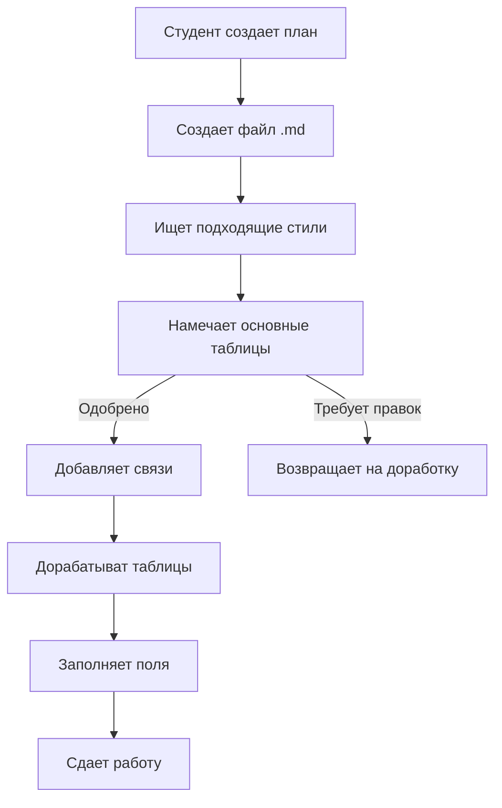

# 🎓 **Домашнее задание** 
## 📋 **База данных** - разработайте план для любой игры которая вам нравиться
- [x] Сущности (основные таблицы от 2 до 5)
- [x] Связи между таблицами (один ко многим, многие ко многим)
- [x] Таблицы взаимосвязий и основные их поля (от 3 и более)
- [x] Использовать Markdown для написания и представления
- [X] Сдать можно ссылкой на файл на Git Hub или Gist

