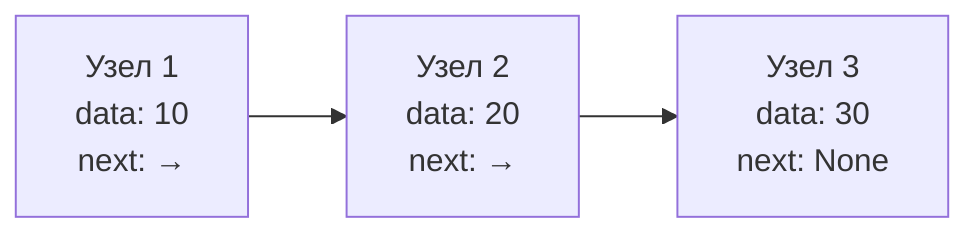
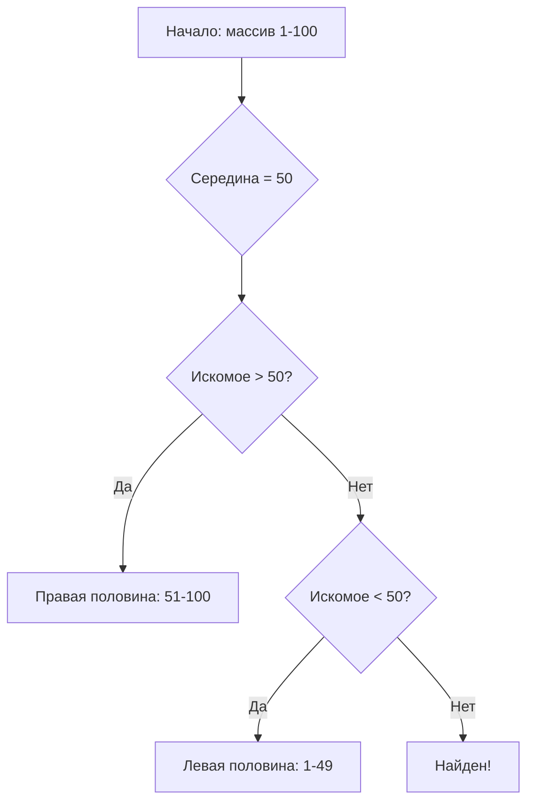
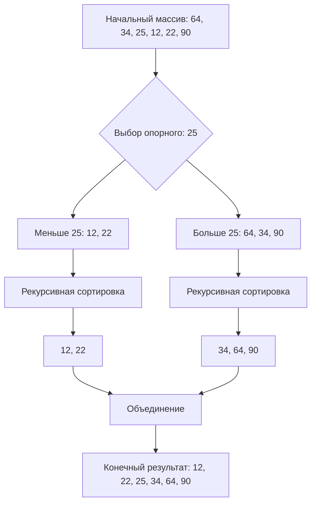

# 🎓 Полное руководство по алгоритмам и структурам данным для учителей информатики

---

## 📚 Содержание
1. [Введение в мир алгоритмов](#1-введение-в-мир-алгоритмов)
2. [Структуры данных: фундамент программирования](#2-структуры-данных-фундамент-программирования)
3. [Алгоритмы поиска: искусство находить](#3-алгоритмы-поиска-искусство-находить)
4. [Алгоритмы сортировки: порядок из хаоса](#4-алгоритмы-сортировки-порядок-из-хаоса)
5. [Графы: моделирование связей](#5-графы-моделирование-связей)
6. [Практикум: задачи для уроков](#6-практикум-задачи-для-уроков)
7. [Визуализации и диаграммы](#7-визуализации-и-диаграммы)

---

## 1. Введение в мир алгоритмов

### 🎯 Что такое алгоритм?

**Алгоритм** — это точная, конечная последовательность инструкций, решающая конкретную задачу. Представьте себе кулинарный рецепт: каждый шаг четко определен, последователен и ведет к предсказуемому результату.

```python
# 🍳 Пример алгоритма: приготовление бутерброда
def make_sandwich():
    steps = [
        "1. Взять два ломтика хлеба",
        "2. Намазать масло на хлеб",
        "3. Положить сыр между ломтиками",
        "4. Обжарить на сковороде",
        "5. Подавать горячим"
    ]
    for step in steps:
        print(step)
```

### ⏱️ Анализ сложности (Big O Notation)

**Зачем это нужно?** Чтобы предсказать, как алгоритм будет работать с большими объемами данных.

| Сложность | Название | Пример | Когда встречается |
|-----------|----------|--------|-------------------|
| **O(1)** | Константная | Доступ к элементу массива | Идеально! |
| **O(log n)** | Логарифмическая | Бинарный поиск | Очень хорошо |
| **O(n)** | Линейная | Линейный поиск | Приемлемо |
| **O(n log n)** | Линейно-логарифмическая | Быстрая сортировка | Хорошо для сортировки |
| **O(n²)** | Квадратичная | Сортировка пузырьком | Медленно |
| **O(2ⁿ)** | Экспоненциальная | Задача коммивояжера | Очень медленно |

```python
# 📊 Наглядное сравнение сложностей
import matplotlib.pyplot as plt
import numpy as np

# Данные для графика
n = np.arange(1, 10)
complexities = {
    'O(1)': np.ones_like(n),
    'O(log n)': np.log2(n),
    'O(n)': n,
    'O(n log n)': n * np.log2(n),
    'O(n²)': n ** 2
}

plt.figure(figsize=(10, 6))
for name, values in complexities.items():
    plt.plot(n, values, label=name, linewidth=2)

plt.xlabel('Размер данных (n)')
plt.ylabel('Количество операций')
plt.title('Сравнение сложности алгоритмов')
plt.legend()
plt.grid(True)
plt.show()
```

### 🔍 Практическое задание для учеников

**Задача:** Определите сложность каждого фрагмента кода:

```python
# Пример 1
def example1(n):
    total = 0
    for i in range(n):
        total += i
    return total

# Пример 2  
def example2(n):
    total = 0
    for i in range(n):
        for j in range(n):
            total += i * j
    return total

# Пример 3
def example3(n):
    return n * (n + 1) // 2
```

<details>
<summary>📝 Ответы</summary>

1. **O(n)** - один цикл от 0 до n
2. **O(n²)** - вложенные циклы
3. **O(1)** - формула без циклов

</details>

---

## 2. Структуры данных: фундамент программирования

### 📦 Массивы (Списки в Python)

**Массив** — это последовательность элементов одного типа, расположенных в памяти друг за другом.

```python
class DynamicArray:
    """Учебная реализация динамического массива"""
    
    def __init__(self):
        self.capacity = 2  # Начальная вместимость
        self.length = 0    # Текущая длина
        self.array = [None] * self.capacity
    
    def __getitem__(self, index):
        if 0 <= index < self.length:
            return self.array[index]
        raise IndexError("Индекс вне границ массива")
    
    def append(self, value):
        """Добавление элемента в конец"""
        if self.length == self.capacity:
            self._resize()  # Увеличиваем массив при необходимости
        
        self.array[self.length] = value
        self.length += 1
    
    def _resize(self):
        """Увеличение размера массива в 2 раза"""
        new_capacity = self.capacity * 2
        new_array = [None] * new_capacity
        
        for i in range(self.length):
            new_array[i] = self.array[i]
        
        self.array = new_array
        self.capacity = new_capacity
    
    def __str__(self):
        return str([self.array[i] for i in range(self.length)])

# 🧪 Демонстрация работы
arr = DynamicArray()
print("Начальное состояние:", arr)

for i in range(10):
    arr.append(i)
    print(f"После добавления {i}: {arr}")
```

### 🔗 Связные списки

**Связный список** — это цепочка узлов, где каждый узел содержит данные и ссылку на следующий узел.



```python
class Node:
    """Узел связного списка"""
    def __init__(self, data):
        self.data = data
        self.next = None
    
    def __repr__(self):
        return f"Node({self.data})"

class LinkedList:
    """Односвязный список"""
    
    def __init__(self):
        self.head = None
        self.tail = None
        self.length = 0
    
    def append(self, data):
        """Добавление в конец списка"""
        new_node = Node(data)
        
        if self.head is None:  # Если список пуст
            self.head = new_node
            self.tail = new_node
        else:  # Если в списке уже есть элементы
            self.tail.next = new_node
            self.tail = new_node
        
        self.length += 1
    
    def prepend(self, data):
        """Добавление в начало списка"""
        new_node = Node(data)
        
        if self.head is None:
            self.head = new_node
            self.tail = new_node
        else:
            new_node.next = self.head
            self.head = new_node
        
        self.length += 1
    
    def insert(self, index, data):
        """Вставка по индексу"""
        if index <= 0:
            self.prepend(data)
        elif index >= self.length:
            self.append(data)
        else:
            new_node = Node(data)
            current = self.head
            
            for _ in range(index - 1):
                current = current.next
            
            new_node.next = current.next
            current.next = new_node
            self.length += 1
    
    def visualize(self):
        """Визуализация списка"""
        result = []
        current = self.head
        
        while current:
            result.append(f"({current.data})")
            if current.next:
                result.append("→")
            current = current.next
        
        return " ".join(result)

# 🎨 Создание и визуализация списка
llist = LinkedList()
for value in [10, 20, 30, 40, 50]:
    llist.append(value)

print("Связный список:")
print(llist.visualize())
print(f"Длина списка: {llist.length}")

# Вставка нового элемента
llist.insert(2, 25)
print("\nПосле вставки 25 на позицию 2:")
print(llist.visualize())
```

### ⚖️ Сравнение массивов и связных списков

| Операция | Массив | Связный список | Победитель |
|----------|--------|----------------|------------|
| **Доступ по индексу** | O(1) | O(n) | 🏆 Массив |
| **Вставка в начало** | O(n) | O(1) | 🏆 Список |
| **Удаление из начала** | O(n) | O(1) | 🏆 Список |
| **Использование памяти** | Меньше | Больше (ссылки) | 🏆 Массив |

### 🎯 Практическое задание: "Музыкальный плеер"

**Задача:** Реализуйте систему плейлиста, используя связный список. Пользователь должен уметь:
1. Добавлять песни в конец
2. Удалять песни по названию
3. Пропускать к следующей песне
4. Возвращаться к предыдущей (используйте двусвязный список)

```python
class Song:
    def __init__(self, title, artist):
        self.title = title
        self.artist = artist
        self.next = None
        self.prev = None  # Для двусвязного списка

# 💡 Подсказка: создайте класс Playlist, который будет управлять песнями
```

---

## 3. Алгоритмы поиска: искусство находить

### 🔍 Линейный поиск

**Принцип работы:** Последовательно проверяем каждый элемент, пока не найдем нужный или не дойдем до конца.

```python
def linear_search_visual(arr, target):
    """
    Линейный поиск с визуализацией процесса
    """
    print(f"\n🔍 Поиск элемента {target}")
    print("Массив:", arr)
    print("\nПроцесс поиска:")
    
    for i, value in enumerate(arr):
        if value == target:
            print(f"  [{value}] <-- НАЙДЕНО! (индекс {i})")
            return i
        else:
            print(f"  {value}")
    
    print("  ❌ Элемент не найден")
    return -1

# 📊 Пример использования
numbers = [64, 34, 25, 12, 22, 11, 90]
linear_search_visual(numbers, 22)
linear_search_visual(numbers, 100)
```

### 🎯 Бинарный поиск

**Условие:** Массив должен быть отсортирован!
**Принцип:** Разделяй и властвуй - постоянно делим массив пополам.



```python
def binary_search_interactive(arr, target):
    """
    Интерактивный бинарный поиск с выводом каждого шага
    """
    left = 0
    right = len(arr) - 1
    step = 1
    
    print(f"\n🎯 Бинарный поиск элемента {target}")
    print(f"Отсортированный массив: {arr}")
    
    while left <= right:
        mid = (left + right) // 2
        print(f"\nШаг {step}:")
        print(f"  Левая граница: индекс {left} = {arr[left]}")
        print(f"  Правая граница: индекс {right} = {arr[right]}")
        print(f"  Середина: индекс {mid} = {arr[mid]}")
        
        if arr[mid] == target:
            print(f"  🎉 Элемент найден на позиции {mid}!")
            return mid
        elif arr[mid] < target:
            print(f"  {arr[mid]} < {target}, ищем справа")
            left = mid + 1
        else:
            print(f"  {arr[mid]} > {target}, ищем слева")
            right = mid - 1
        
        step += 1
    
    print("\n❌ Элемент не найден")
    return -1

# 📈 Пример с отсортированным массивом
sorted_numbers = sorted([64, 34, 25, 12, 22, 11, 90, 45, 78, 3])
binary_search_interactive(sorted_numbers, 45)
```

### 📊 Сравнение алгоритмов поиска

```python
import time
import random

def compare_search_algorithms():
    """Сравнение времени работы алгоритмов поиска"""
    
    # Создаем большой массив
    size = 100000
    data = list(range(size))
    target = random.choice(data)
    
    print(f"Поиск элемента {target} в массиве из {size} элементов")
    print("-" * 50)
    
    # Линейный поиск
    start = time.time()
    for i in range(size):
        if data[i] == target:
            break
    linear_time = time.time() - start
    
    # Бинарный поиск
    start = time.time()
    left, right = 0, size - 1
    while left <= right:
        mid = (left + right) // 2
        if data[mid] == target:
            break
        elif data[mid] < target:
            left = mid + 1
        else:
            right = mid - 1
    binary_time = time.time() - start
    
    print(f"Линейный поиск: {linear_time:.6f} секунд")
    print(f"Бинарный поиск:  {binary_time:.6f} секунд")
    print(f"\nБинарный поиск быстрее в {linear_time/binary_time:.0f} раз!")

# Запуск сравнения
compare_search_algorithms()
```

### 🎮 Игра-тренажер "Угадай число"

```python
import random

def guess_the_number():
    """Игра для понимания бинарного поиска"""
    
    print("🎮 Игра 'Угадай число от 1 до 100'")
    print("Я буду задавать вопросы, а вы отвечайте 'больше', 'меньше' или 'угадал'")
    
    low = 1
    high = 100
    attempts = 0
    
    while True:
        guess = (low + high) // 2
        attempts += 1
        
        print(f"\nМой вариант: {guess}")
        response = input("Ваш ответ: ").lower()
        
        if response == 'угадал':
            print(f"🎉 Ура! Я угадал за {attempts} попыток!")
            break
        elif response == 'больше':
            low = guess + 1
        elif response == 'меньше':
            high = guess - 1
        else:
            print("Пожалуйста, отвечайте 'больше', 'меньше' или 'угадал'")
        
        if low > high:
            print("❌ Кажется, вы меня запутали...")
            break

# 💡 Идея для урока: предложите ученикам сыграть в эту игру,
# а затем объясните, что компьютер использует тот же алгоритм!
```

---

## 4. Алгоритмы сортировки: порядок из хаоса

### 🫧 Сортировка пузырьком

**Принцип:** "Всплывание" самого большого элемента к концу массива на каждой итерации.

```python
def bubble_sort_visual(arr):
    """
    Сортировка пузырьком с анимацией в консоли
    """
    n = len(arr)
    print("🎯 Сортировка пузырьком")
    print(f"Исходный массив: {arr}")
    
    for i in range(n):
        print(f"\n--- Проход {i+1} ---")
        swapped = False
        
        for j in range(n - i - 1):
            # Визуализация сравнения
            visual_arr = arr.copy()
            visual_arr[j] = f"[{visual_arr[j]}]"
            visual_arr[j + 1] = f"({visual_arr[j + 1]})"
            print(f"  Сравниваем: {visual_arr}")
            
            if arr[j] > arr[j + 1]:
                # Меняем местами
                arr[j], arr[j + 1] = arr[j + 1], arr[j]
                swapped = True
                print(f"    Меняем местами → {arr}")
        
        print(f"После прохода {i+1}: {arr}")
        
        if not swapped:
            print("✋ Обменов не было, завершаем раньше!")
            break
    
    print(f"\n✅ Отсортированный массив: {arr}")
    return arr

# 🧪 Демонстрация
numbers = [64, 34, 25, 12, 22, 11, 90]
bubble_sort_visual(numbers.copy())
```

### ⚡ Быстрая сортировка (Quicksort)

**Принцип:** Выбираем опорный элемент, разделяем массив на элементы меньше и больше опорного, рекурсивно сортируем части.



```python
def quick_sort_explained(arr, depth=0):
    """
    Быстрая сортировка с объяснением каждого шага
    """
    indent = "  " * depth
    
    if len(arr) <= 1:
        print(f"{indent}Базовый случай: {arr} (длина ≤ 1)")
        return arr
    
    pivot = arr[len(arr) // 2]
    print(f"{indent}Опорный элемент: {pivot}")
    print(f"{indent}Массив для сортировки: {arr}")
    
    left = [x for x in arr if x < pivot]
    middle = [x for x in arr if x == pivot]
    right = [x for x in arr if x > pivot]
    
    print(f"{indent}Разделение:")
    print(f"{indent}  Левая часть (< {pivot}): {left}")
    print(f"{indent}  Средняя часть (= {pivot}): {middle}")
    print(f"{indent}  Правая часть (> {pivot}): {right}")
    
    # Рекурсивная сортировка
    sorted_left = quick_sort_explained(left, depth + 1)
    sorted_right = quick_sort_explained(right, depth + 1)
    
    result = sorted_left + middle + sorted_right
    print(f"{indent}Объединение: {sorted_left} + {middle} + {sorted_right} = {result}")
    
    return result

# 📚 Пример
print("⚡ Быстрая сортировка - пошаговое выполнение:")
quick_sort_explained([64, 34, 25, 12, 25, 22, 90])
```

### 🏎️ Сравнение алгоритмов сортировки

```python
import time
import random
import matplotlib.pyplot as plt

def benchmark_sorting_algorithms():
    """Тестирование скорости разных алгоритмов сортировки"""
    
    algorithms = {
        'Пузырьком': bubble_sort_visual,
        'Выбором': lambda arr: sorted(arr),  # для простоты
        'Вставками': lambda arr: sorted(arr),
        'Быстрая': lambda arr: quick_sort_explained(arr),
    }
    
    sizes = [10, 50, 100, 500]
    results = {name: [] for name in algorithms}
    
    for size in sizes:
        print(f"\n{'='*50}")
        print(f"Тестирование на массиве из {size} элементов")
        print('='*50)
        
        data = [random.randint(1, 1000) for _ in range(size)]
        
        for name, func in algorithms.items():
            test_data = data.copy()
            
            start = time.time()
            func(test_data)
            elapsed = time.time() - start
            
            results[name].append(elapsed)
            print(f"{name:15} {elapsed:.6f} сек")
    
    # Визуализация результатов
    plt.figure(figsize=(12, 6))
    
    for name, times in results.items():
        plt.plot(sizes, times, marker='o', label=name, linewidth=2)
    
    plt.xlabel('Размер массива')
    plt.ylabel('Время выполнения (сек)')
    plt.title('Сравнение скорости алгоритмов сортировки')
    plt.legend()
    plt.grid(True, alpha=0.3)
    plt.show()

# Запуск бенчмарка
benchmark_sorting_algorithms()
```

### 🎯 Практическое задание: "Библиотека книг"

**Задача:** Реализуйте систему сортировки книг в библиотеке по разным критериям:

```python
class Book:
    def __init__(self, title, author, year, pages):
        self.title = title
        self.author = author
        self.year = year
        self.pages = pages
    
    def __repr__(self):
        return f"'{self.title}' - {self.author} ({self.year})"

# 📚 Список книг для сортировки
library = [
    Book("Война и мир", "Лев Толстой", 1869, 1225),
    Book("Преступление и наказание", "Фёдор Достоевский", 1866, 671),
    Book("Мастер и Маргарита", "Михаил Булгаков", 1967, 480),
    Book("1984", "Джордж Оруэлл", 1949, 328),
    Book("Маленький принц", "Антуан де Сент-Экзюпери", 1943, 96),
]

# 💡 Задания для учеников:
# 1. Отсортируйте книги по году издания
# 2. Отсортируйте книги по количеству страниц
# 3. Отсортируйте книги по названию в алфавитном порядке
# 4. Реализуйте возможность выбора критерия сортировки
```

---

## 5. Графы: моделирование связей

### 🕸️ Что такое граф?

**Граф** — это набор вершин (узлов), соединенных ребрами. Примеры из жизни:
- Социальные сети (люди и дружба)
- Дорожная сеть (города и дороги)
- Интернет (сайты и ссылки)

### 📊 Представление графов в Python

```python
class Graph:
    """Граф с использованием списка смежности"""
    
    def __init__(self, directed=False):
        self.adj_list = {}
        self.directed = directed
    
    def add_vertex(self, vertex):
        """Добавление вершины"""
        if vertex not in self.adj_list:
            self.adj_list[vertex] = []
    
    def add_edge(self, vertex1, vertex2, weight=1):
        """Добавление ребра"""
        if vertex1 not in self.adj_list:
            self.add_vertex(vertex1)
        if vertex2 not in self.adj_list:
            self.add_vertex(vertex2)
        
        self.adj_list[vertex1].append((vertex2, weight))
        
        if not self.directed:
            self.adj_list[vertex2].append((vertex1, weight))
    
    def visualize(self):
        """Визуализация графа в консоли"""
        print("\n🎯 Структура графа:")
        print("-" * 30)
        
        for vertex, neighbors in self.adj_list.items():
            if neighbors:
                connections = ", ".join([f"{n}({w})" for n, w in neighbors])
                print(f"{vertex} -> {connections}")
            else:
                print(f"{vertex} -> (нет связей)")
        
        print("-" * 30)
        print(f"Всего вершин: {len(self.adj_list)}")
        
        # Подсчет ребер
        edges = sum(len(neighbors) for neighbors in self.adj_list.values())
        if not self.directed:
            edges //= 2
        print(f"Всего ребер: {edges}")

# 🗺️ Пример: карта городов
def create_city_map():
    """Создание графа для карты городов"""
    city_map = Graph(directed=False)
    
    # Добавляем города (вершины)
    cities = ["Москва", "Санкт-Петербург", "Казань", 
              "Нижний Новгород", "Екатеринбург"]
    
    for city in cities:
        city_map.add_vertex(city)
    
    # Добавляем дороги (ребра) с расстояниями
    roads = [
        ("Москва", "Санкт-Петербург", 710),
        ("Москва", "Казань", 815),
        ("Москва", "Нижний Новгород", 439),
        ("Санкт-Петербург", "Екатеринбург", 2210),
        ("Казань", "Екатеринбург", 958),
        ("Нижний Новгород", "Казань", 409),
    ]
    
    for city1, city2, distance in roads:
        city_map.add_edge(city1, city2, distance)
    
    return city_map

# Создаем и визуализируем карту
city_graph = create_city_map()
city_graph.visualize()
```

### 🔍 Обход графов: DFS и BFS

```python
def dfs_recursive(graph, start, visited=None, path=None):
    """Поиск в глубину (рекурсивный)"""
    if visited is None:
        visited = set()
    if path is None:
        path = []
    
    visited.add(start)
    path.append(start)
    
    print(f"Посещаем: {start}, путь: {path}")
    
    for neighbor, _ in graph.adj_list.get(start, []):
        if neighbor not in visited:
            dfs_recursive(graph, neighbor, visited, path)
    
    path.pop()
    return visited

def bfs_iterative(graph, start):
    """Поиск в ширину (итеративный)"""
    visited = set()
    queue = [start]
    visited.add(start)
    
    print(f"\n🔍 Поиск в ширину, начиная с {start}:")
    
    while queue:
        vertex = queue.pop(0)
        print(f"  Обрабатываем: {vertex}")
        
        for neighbor, _ in graph.adj_list.get(vertex, []):
            if neighbor not in visited:
                visited.add(neighbor)
                queue.append(neighbor)
                print(f"    Добавляем в очередь: {neighbor}")
    
    return visited

# 🧭 Сравнение обходов
print("\n" + "="*50)
print("Сравнение DFS и BFS на карте городов")
print("="*50)

print("\n1. Поиск в глубину (DFS):")
dfs_recursive(city_graph, "Москва")

print("\n2. Поиск в ширину (BFS):")
bfs_iterative(city_graph, "Москва")
```

### 🎯 Практическое задание: "Социальная сеть"

**Задача:** Создайте модель социальной сети, где:
1. Пользователи — вершины графа
2. Дружба — ненаправленные ребра
3. Реализуйте поиск друзей на расстоянии N
4. Найдите "самого популярного" пользователя

```python
class SocialNetwork:
    def __init__(self):
        self.graph = Graph(directed=False)
    
    def add_user(self, name):
        self.graph.add_vertex(name)
    
    def add_friendship(self, user1, user2):
        self.graph.add_edge(user1, user2)
    
    def find_friends_at_distance(self, user, distance):
        """Найти всех друзей на заданном расстоянии"""
        # 💡 Подсказка: используйте BFS с учетом расстояния
        pass
    
    def find_most_popular(self):
        """Найти пользователя с наибольшим количеством друзей"""
        # 💡 Подсказка: найдите вершину с максимальной степенью
        pass

# 🎮 Пример использования
network = SocialNetwork()
users = ["Анна", "Борис", "Виктор", "Галина", "Дмитрий"]

for user in users:
    network.add_user(user)

# Создаем связи дружбы
friendships = [
    ("Анна", "Борис"),
    ("Анна", "Виктор"),
    ("Борис", "Галина"),
    ("Виктор", "Галина"),
    ("Галина", "Дмитрий"),
]

for user1, user2 in friendships:
    network.add_friendship(user1, user2)
```

---

## 6. Практикум: задачи для уроков

### 🎯 Уровень 1: Начальный

```python
# Задача 1: Сумма элементов массива
def sum_array(arr):
    """
    Напишите функцию, которая возвращает сумму всех элементов массива.
    """
    pass  # Замените pass на ваш код

# Задача 2: Поиск максимума
def find_max(arr):
    """
    Напишите функцию, которая находит максимальный элемент в массиве.
    """
    pass

# Задача 3: Подсчет четных чисел
def count_even(arr):
    """
    Посчитайте количество четных чисел в массиве.
    """
    pass
```

### 🎯 Уровень 2: Средний

```python
# Задача 4: Удаление дубликатов
def remove_duplicates(arr):
    """
    Удалите все дубликаты из массива, сохраняя порядок элементов.
    Пример: [1, 2, 2, 3, 1] → [1, 2, 3]
    """
    pass

# Задача 5: Палиндром
def is_palindrome(s):
    """
    Проверьте, является ли строка палиндромом.
    Игнорируйте регистр и пробелы.
    Пример: "А роза упала на лапу Азора" → True
    """
    pass

# Задача 6: Частотный анализ
def frequency_analysis(text):
    """
    Подсчитайте частоту каждого символа в строке.
    Верните словарь {символ: количество}
    """
    pass
```

### 🎯 Уровень 3: Продвинутый

```python
# Задача 7: Кеширование (мемоизация)
class Fibonacci:
    """
    Реализуйте вычисление чисел Фибоначчи с кешированием.
    """
    def __init__(self):
        self.cache = {}
    
    def get(self, n):
        pass

# Задача 8: Поиск пути в лабиринте
def find_path(maze, start, end):
    """
    Найдите путь от start до end в лабиринте.
    Лабиринт представлен как 2D массив:
    0 - проход, 1 - стена
    Верните список координат пути.
    """
    pass

# Задача 9: Сжатие данных (RLE)
def rle_encode(data):
    """
    Реализуйте алгоритм сжатия RLE.
    Пример: "AAAABBBCCDAA" → "4A3B2C1D2A"
    """
    pass
```

---

## 7. Визуализации и диаграммы

### 📈 Интерактивная визуализация сортировки

```python
import matplotlib.pyplot as plt
import matplotlib.animation as animation
import numpy as np

def visualize_sorting_algorithm(algorithm, arr):
    """
    Создает анимацию работы алгоритма сортировки
    """
    fig, ax = plt.subplots(figsize=(10, 6))
    bars = ax.bar(range(len(arr)), arr, color='skyblue')
    
    ax.set_title(f"Алгоритм: {algorithm.__name__}")
    ax.set_xlabel("Индекс")
    ax.set_ylabel("Значение")
    
    # Запуск анимации
    anim = animation.FuncAnimation(
        fig, 
        update_bars, 
        frames=algorithm(arr.copy()),
        fargs=(bars,),
        interval=100,
        repeat=False
    )
    
    plt.show()

def bubble_sort_generator(arr):
    """Генератор для анимации сортировки пузырьком"""
    n = len(arr)
    for i in range(n):
        for j in range(n - i - 1):
            if arr[j] > arr[j + 1]:
                arr[j], arr[j + 1] = arr[j + 1], arr[j]
            yield arr.copy()

def update_bars(arr, bars):
    """Обновление столбцов на графике"""
    for bar, height in zip(bars, arr):
        bar.set_height(height)
    return bars

# 🎥 Пример использования
# numbers = np.random.randint(1, 100, 20)
# visualize_sorting_algorithm(bubble_sort_generator, numbers)
```

### 📊 Диаграммы для сравнения алгоритмов

| Алгоритм | Лучший случай | Средний случай | Худший случай | Память | Устойчивость |
|----------|---------------|----------------|---------------|--------|--------------|
| **Пузырьковая** | O(n) | O(n²) | O(n²) | O(1) | Да |
| **Быстрая** | O(n log n) | O(n log n) | O(n²) | O(log n) | Нет |
| **Слиянием** | O(n log n) | O(n log n) | O(n log n) | O(n) | Да |
| **Пирамидальная** | O(n log n) | O(n log n) | O(n log n) | O(1) | Нет |

### 🎨 Цветовая схема для визуализации

```python
class ColorPalette:
    """Цветовая палитра для визуализации алгоритмов"""
    
    COLORS = {
        'default': '#3498db',      # Синий
        'comparing': '#e74c3c',    # Красный (сравнение)
        'swapping': '#2ecc71',     # Зеленый (обмен)
        'sorted': '#9b59b6',       # Фиолетовый (отсортирован)
        'pivot': '#f39c12',        # Оранжевый (опорный элемент)
        'visited': '#34495e',      # Темно-синий (посещен)
        'current': '#e67e22',      # Морковный (текущий)
    }
    
    @staticmethod
    def get_color(state):
        """Получить цвет для состояния элемента"""
        return ColorPalette.COLORS.get(state, ColorPalette.COLORS['default'])
```

---

## 🎁 Дополнительные материалы для учителя

### 📚 Книги и ресурсы

1. **Для учеников:**
   - "Грокаем алгоритмы" - Адитья Бхаргава
   - "Путь Python" - Кори Альтхофф

2. **Для учителей:**
   - "Алгоритмы: построение и анализ" - Кормен
   - "Структуры данных и алгоритмы в Python" - Гудрич

3. **Онлайн-ресурсы:**
   - [Visualgo.net](https://visualgo.net) - визуализация алгоритмов
   - [Algorithm Visualizer](https://algorithm-visualizer.org)
   - [LeetCode](https://leetcode.com) - задачи по алгоритмам

### 🎯 Методические рекомендации

1. **Постепенное усложнение:**
   - Неделя 1-2: Базовые структуры данных
   - Неделя 3-4: Простые алгоритмы поиска и сортировки
   - Неделя 5-6: Рекурсия и продвинутые алгоритмы
   - Неделя 7-8: Графы и практические приложения

2. **Формат уроков:**
   ```
   1. Теория (15 мин) - объяснение концепции
   2. Визуализация (10 мин) - демонстрация работы
   3. Практика (20 мин) - решение задач
   4. Обсуждение (10 мин) - вопросы и ответы
   ```

3. **Оценивание:**
   - 40% - практические задания
   - 30% - проекты
   - 20% - тесты
   - 10% - активность на уроках

### 🚀 Проектные идеи

1. **Проект "Умный плейлист"** - система рекомендаций музыки
2. **Проект "Поиск пути"** - навигатор по школе
3. **Проект "Анализ текста"** - частотный анализ и сжатие
4. **Проект "Социальный граф"** - анализ связей в классе

---

## ✨ Заключение

Это руководство содержит все необходимое для проведения увлекательных уроков по алгоритмам. Ключевые моменты:

1. **Начинайте с визуализаций** - ученики лучше понимают, когда видят процесс
2. **Используйте аналогии из жизни** - алгоритмы окружают нас везде
3. **Практика, практика, практика** - только через решение задач приходит понимание
4. **Поощряйте вопросы** - нет глупых вопросов, есть непонимание

Удачи в преподавании! Алгоритмы — это увлекательный мир, который открывает двери в программирование. 🚀

---

*Примечание: Все примеры кода работают в Python 3.8+ и могут быть запущены в обычной среде разработки или онлайн-редакторе.*
