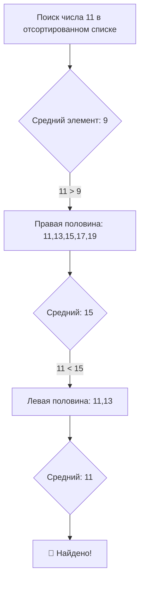

# 🎯 Основные структуры данных: Списки и Деревья
## Практическое руководство с примерами на Python

---

> *"Плохие программисты беспокоятся о коду. Хорошие программисты беспокоятся о структурах данных и их отношениях."*  
> — Линус Торвальдс

---

## 📊 **Списки: Основа всего**

### Аналогия со списком покупок
```python
# Каждый список имеет три основные операции:
# 1. Создать список
# 2. Добавить в список  
# 3. Прочитать из списка

items = ["milk", "bread", "eggs", "cheese"]

# Чтение элементов
items[0]      # Первый элемент: "milk"
items[-1]     # Последний элемент: "cheese"  

# Изменение списка
items.append("butter")          # Добавить в конец
items.insert(1, "honey")        # Вставить на позицию
items.remove("bread")           # Удалить по значению

len(items)                      # Длина списка
```

> **Ключевая идея:** Списки сохраняют порядок и позволяют дубликаты. Представьте их как пронумерованные полки, где у каждого предмета есть своё место.

---

### Практический пример: Оценки студентов
```python
students = [
    ["Anna", [90, 85, 92]],
    ["Boris", [78, 82, 80]],
    ["Victor", [95, 98, 96]]
]

def calculate_averages(grades_list):
    result = []
    
    for name, grades in grades_list:
        average = sum(grades) / len(grades)
        result.append([name, round(average, 1)])
    
    return result

# Найти лучшего студента
averages = calculate_averages(students)

best_student = averages[0]
for student in averages:
    if student[1] > best_student[1]:
        best_student = student
```

---

## 🔍 **Алгоритмы поиска в списках**

### Линейный поиск: Проверка каждого элемента
```python
def linear_search(items, target):
    for position, item in enumerate(items):
        if item == target:
            return position
    return -1

# Пример: Поиск книги на полке
books = ["Python для начинающих", "Clean Code", 
         "Deep Work", "Atomic Habits", "The Pragmatic Programmer"]

book_to_find = "Deep Work"
position = linear_search(books, book_to_find)
```

> **Когда использовать:** Небольшие списки, несортированные данные или когда нужно найти все совпадения.

---

### Бинарный поиск: Метод "Разделяй и властвуй"
```python
def binary_search(sorted_list, target):
    left = 0
    right = len(sorted_list) - 1
    
    while left <= right:
        middle = (left + right) // 2
        
        if sorted_list[middle] == target:
            return middle
        elif sorted_list[middle] < target:
            left = middle + 1
        else:
            right = middle - 1
    
    return -1

# Должен быть отсортирован!
numbers = [1, 3, 5, 7, 9, 11, 13, 15, 17, 19]
target = 11

result = binary_search(numbers, target)
```



---

## 🌳 **Деревья: Иерархические данные**

### Структура генеалогического дерева
```python
class TreeNode:
    def __init__(self, data):
        self.data = data
        self.children = []
    
    def add_child(self, child_node):
        self.children.append(child_node)
    
    def display(self, level=0):
        indent = "  " * level
        
        for child in self.children:
            child.display(level + 1)

# Построение простого семейного дерева
grandfather = TreeNode("Grandfather")
father = TreeNode("Father")
uncle = TreeNode("Uncle")

grandfather.add_child(father)
grandfather.add_child(uncle)

father.add_child(TreeNode("Son"))
father.add_child(TreeNode("Daughter"))
uncle.add_child(TreeNode("Cousin"))
```

---

## 🎯 **Бинарные деревья поиска (БДП)**

### Принцип сортирующего дерева
> *Бинарное дерево поиска сохраняет порядок: левый ребёнок < родитель < правый ребёнок*

```python
class BSTNode:
    def __init__(self, value):
        self.value = value
        self.left = None
        self.right = None
    
    def insert(self, new_value):
        if new_value < self.value:
            if self.left is None:
                self.left = BSTNode(new_value)
            else:
                self.left.insert(new_value)
        else:
            if self.right is None:
                self.right = BSTNode(new_value)
            else:
                self.right.insert(new_value)
    
    def inorder_traversal(self):
        elements = []
        
        if self.left:
            elements += self.left.inorder_traversal()
        
        elements.append(self.value)
        
        if self.right:
            elements += self.right.inorder_traversal()
        
        return elements

# Построение БДП
numbers = [8, 3, 10, 1, 6, 14, 4, 7, 13]
root = BSTNode(numbers[0])

for number in numbers[1:]:
    root.insert(number)

sorted_numbers = root.inorder_traversal()
```

---

## 🎮 **Интерактивный пример: Игра с БДП**

```python
import random

class NumberGame:
    def __init__(self):
        self.numbers = random.sample(range(1, 101), 15)
        self.root = None
        self.build_tree()
    
    def build_tree(self):
        if not self.numbers:
            return
        
        self.root = BSTNode(self.numbers[0])
        for number in self.numbers[1:]:
            self.root.insert(number)
    
    def find_number(self, guess):
        current = self.root
        
        while current:
            if guess == current.value:
                return True
            elif guess < current.value:
                current = current.left
            else:
                current = current.right
        
        return False
    
    def play(self):
        guessed = []
        attempts = 0
        
        while len(guessed) < len(self.numbers):
            attempts += 1
            
            if self.find_number(guess):
                if guess not in guessed:
                    guessed.append(guess)
```

---

## 📊 **Сравнение производительности**

```python
import time

def compare_search():
    data_size = 10000
    test_data = list(range(data_size))
    target = data_size - 1
    
    # Линейный поиск
    start = time.time()
    for _ in range(100):
        linear_search(test_data, target)
    linear_time = time.time() - start
    
    # Бинарный поиск
    start = time.time()
    for _ in range(100):
        binary_search(test_data, target)
    binary_time = time.time() - start
    
    difference = linear_time / binary_time
```

---

## 🔧 **Практическое применение: Навигатор файловой системы**

```python
class FileSystemNode:
    def __init__(self, name, is_file=False):
        self.name = name
        self.is_file = is_file
        self.children = {}
    
    def add_path(self, path):
        parts = path.split('/')
        current = self
        
        for part in parts:
            if part not in current.children:
                is_txt_file = part.endswith('.txt')
                current.children[part] = FileSystemNode(part, is_txt_file)
            current = current.children[part]
    
    def display_structure(self, prefix=""):
        for child in self.children.values():
            child.display_structure(prefix + "  ")

# Симуляция файловой системы
fs = FileSystemNode("/")

files = [
    "documents/report.txt",
    "documents/notes.txt", 
    "photos/vacation/beach.jpg",
    "photos/vacation/mountains.jpg",
    "code/main.py",
    "code/utils/helper.py"
]

for file_path in files:
    fs.add_path(file_path)
```

---

## 🎯 **Быстрая памятка: Что использовать и когда**

| Структура | Лучше всего подходит для | Сложность поиска | Использование памяти |
|-----------|--------------------------|------------------|----------------------|
| **Список** | Последовательные данные, маленькие наборы, частые изменения | O(n) | O(n) |
| **Отсортированный список** | Предварительно отсортированные данные, бинарный поиск | O(log n) с бинарным поиском | O(n) |
| **Бинарное дерево поиска** | Динамические отсортированные данные, запросы по диапазону | O(log n) в среднем | O(n) |

---

## 💡 **Ключевые выводы**

1. **Списки** — ваш основной инструмент для упорядоченных коллекций
2. **Бинарный поиск** требует сортировки данных, но чрезвычайно быстр
3. **Деревья** превосходны для иерархических отношений
4. **БДП** автоматически поддерживают отсортированный порядок
5. Выбирайте структуру на основе наиболее частых операций

---

## 📝 **Задание для практики**

```python
def analyze_text(text):
    words = text.lower().split()
    frequency = {}
    
    for word in words:
        if word in frequency:
            frequency[word] += 1
        else:
            frequency[word] = 1
    
    sorted_items = []
    for word, count in frequency.items():
        sorted_items.append([word, count])
    
    for i in range(len(sorted_items)):
        for j in range(i + 1, len(sorted_items)):
            if sorted_items[i][1] < sorted_items[j][1]:
                sorted_items[i], sorted_items[j] = sorted_items[j], sorted_items[i]
    
    result = []
    for i in range(min(5, len(sorted_items))):
        result.append(sorted_items[i][0])
    
    return result

# Проверка решения
sample_text = """
Python is great for data structures. 
Data structures in Python make programming efficient.
Python Python Python efficiency structures.
"""

top_words = analyze_text(sample_text)
```

---

> *"Разница между плохим программистом и хорошим программистом заключается в том, считает ли он свой код или свои структуры данных более важными. Плохие программисты беспокоятся о коде. Хорошие программисты беспокоятся о структурах данных и их отношениях."*  
> Освойте силу правильной организации данных.
